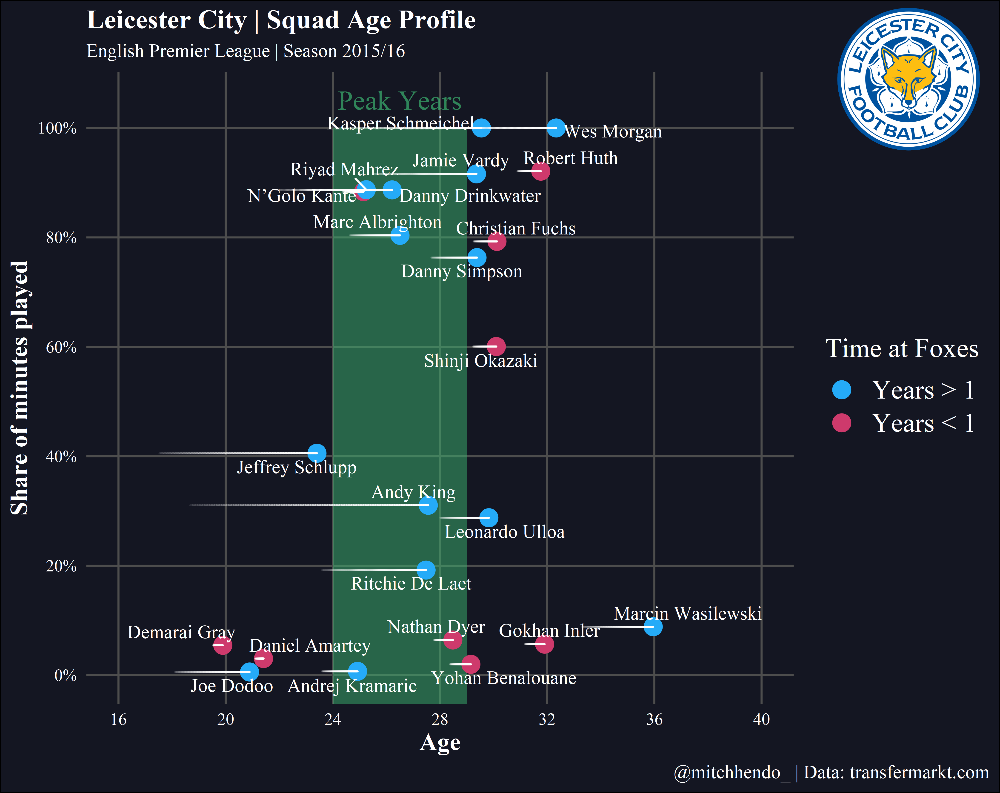

```{r setup, include=FALSE}
knitr::opts_chunk$set(echo = TRUE,
                      fig.show = "hold",
                      fig.align = "center",
                      tidy = FALSE)
```

## 加载经常用的R包

下面的软件包需要在r脚本的开头加载。如果这是第一次在您的计算机上使用这些软件包，请确保首先安装它们(例如install.packages (“package name”))。

在 r 中使用不同的字体可能很棘手，尤其是在Windows机器上(就像我使用的那样)。在安装和加载`extrafont`包之后，在第一次使用它之前，您需要运行`font_import()`，它将计算机中的所有字体加载到r中。这可能需要一段时间(2-5分钟)，但只需要完成一次(除非您以后添加新的字体)。然后可以运行`fonts()`查看所有可用的字体。从那时起，您只需要在脚本的开头运行`extrafont::loadfonts(device = "win")`

```{r,warning=FALSE,message=FALSE}
library(pacman)
p_load(tidyverse,stringr,DT,skimr,DataExplorer,grf,glmnet,caret,tidytext,
       explore,patchwork,ggrepel,ggcorrplot,gghighlight,ggthemes,fpp2,
       forecast,magrittr,readxl,writexl,listviewer,car,tseries,vtable)
library(lubridate)
library(ggforce)
```

## 加载数据

```{r}
data <- read_excel("../data/data.xlsx")
data %>% datatable()
```

```{r}
data %>% knitr::kable()
```

```{r}
# Title, subtitle, and legend
team_name <- "Leicester City"
short_name <- "Foxes"
league <- "English Premier League"
season <- "2015/16"

# Caption
data_source <- "transfermarkt.com"
social_media_handle <- "@mitchhendo_"

# Name of logo file within working directory
logo_file_name <- "leicester_logo.png"
```

```{r}
data %>%
  mutate(
    dob = dmy(dob),
    # Recognise this column as a date
    
    reference_date = dmy(reference_date),
    # Recognise this column as a date
    
    arrival_at_team = dmy(arrival_at_team),
    # Recognise this column as a date
    
    age = (reference_date - dob) / 365,
    # Create a new column that calculates each players age at the reference date
    
    age_at_arrival = (arrival_at_team - dob) / 365,
    # Create a new column that calculates each players age at arrival to the club
    
    time_with_team = as_factor(
      ifelse(arrival_at_team < reference_date - 365, "Years > 1", "Years < 1")
    )
    # Create a new column that determines whether a player has been at the club for longer than a year or not
  ) -> data
```

## 创建图形

首先，我们定义我们想要的**点的颜色**，并称这个对象年的颜色(使用十六进制代码指定颜色)，还定义了一系列的数字，我们称之为索引，这将使我们能够绘制球员后面的拖尾线(显示他们在俱乐部呆了多长时间)。

```{r}
# Colours of the dots
year_colours <- c(`Years > 1` = "#25ABF8", `Years < 1` = "#CE3A6C")

# This vector is needed to draw the trailing lines showing how long a player has been at the club
# Don't change this unless you know what you're doing
index <- c(0, 0.25, 0.5, 0.75, 1)
```

我们将首先使用 ggplot函数，并告诉它我们正在使用的数据来自前面创建的数据对象。Aes()函数用于指定我们的数据的哪些部分将用于绘图，因此我们说x轴将是我们的年龄列，y 轴将是我们的参与度列。

```{r}
ggplot(data = data, 
       aes(x = age, 
           y = percent_involvement)) +
  geom_point(aes(colour = time_with_team), 
             size = 4) +
  theme(text = element_text(family = "Times New Roman")) +
  labs(x = "Age",
       title = paste0(team_name, " | Squad Age Profile"), 
       subtitle = paste0(league, " | Season ", season),
       caption = paste0(social_media_handle, " | Data: ", data_source),
       colour = paste0("Time at ", short_name))
```

接下来，我们将通过使用 `scale_y_continuous()`函数给它一个合适的标题来修正y轴，使用百分比刻度，并告诉它在哪里打破轴滴答。

```{r}
ggplot(data = data, aes(x = age, y = percent_involvement)) +
  geom_point(aes(colour = time_with_team), size = 4) +
  theme(text = element_text(family = "Times New Roman")) +
  labs(x = "Age",
       title = paste0(team_name, " | Squad Age Profile"), 
       subtitle = paste0(league, " | Season ", season),
       caption = paste0(social_media_handle, " | Data: ", data_source),
       colour = paste0("Time at ", short_name)) +
  scale_y_continuous(name = "Share of minutes played",
                     labels = scales::percent,
                     breaks = seq(0,1,0.2))
```

```{r}
ggplot(data = data, aes(x = age, y = percent_involvement)) +
  geom_point(aes(colour = time_with_team), size = 4) +
  theme(text = element_text(family = "Times New Roman")) +
  labs(x = "Age",
       title = paste0(team_name, " | Squad Age Profile"), 
       subtitle = paste0(league, " | Season ", season),
       caption = paste0(social_media_handle, " | Data: ", data_source),
       colour = paste0("Time at ", short_name)) +
  scale_y_continuous(name = "Share of minutes played",
                     labels = scales::percent,
                     breaks = seq(0,1,0.2)) +
  expand_limits(x = c(16, 40), y = c(0, 1)) +
  scale_x_continuous(breaks = seq(16, 40, 4))
```

```{r}
ggplot(data = data, aes(x = age, y = percent_involvement)) +
  geom_point(aes(colour = time_with_team), size = 4) +
  theme(text = element_text(family = "Times New Roman")) +
  labs(x = "Age",
       title = paste0(team_name, " | Squad Age Profile"), 
       subtitle = paste0(league, " | Season ", season),
       caption = paste0(social_media_handle, " | Data: ", data_source),
       colour = paste0("Time at ", short_name)) +
  scale_y_continuous(name = "Share of minutes played",
                     labels = scales::percent,
                     breaks = seq(0,1,0.2)) +
  expand_limits(x = c(16, 40), y = c(0, 1)) +
  scale_x_continuous(breaks = seq(16, 40, 4)) +
  scale_color_manual(values = year_colours)
```

在我的脑海中使用ggplot最有趣的部分之一就是玩弄主题。

在ggplot中还有一些基本的主题，还有一些有趣的主题，可以通过 **hrbrthemes**、 **ggtech** (其主题模仿 AirBnb、 Facebook、 Google 和 Twitter 的风格)和 **ggthemes**(其主题模仿FiveThirtyEight、《华尔街日报》和《经济学人》等公司制作的情节)等软件包来添加。

```{r}
ggplot(data = data, aes(x = age, y = percent_involvement)) +
  geom_point(aes(colour = time_with_team), size = 4) +
  theme(text = element_text(family = "Times New Roman")) +
  labs(x = "Age",
       title = paste0(team_name, " | Squad Age Profile"), 
       subtitle = paste0(league, " | Season ", season),
       caption = paste0(social_media_handle, " | Data: ", data_source),
       colour = paste0("Time at ", short_name)) +
  scale_y_continuous(name = "Share of minutes played",
                     labels = scales::percent,
                     breaks = seq(0,1,0.2)) +
  expand_limits(x = c(16, 40), y = c(0, 1)) +
  scale_x_continuous(breaks = seq(16, 40, 4)) +
  scale_color_manual(values = year_colours) +
  theme_minimal() +
  theme(text = element_text(family = "Times New Roman"))
```

```{r}
ggplot(data = data, aes(x = age, y = percent_involvement)) +
  geom_point(aes(colour = time_with_team), size = 4) +
  theme(text = element_text(family = "Times New Roman")) +
  labs(x = "Age",
       title = paste0(team_name, " | Squad Age Profile"), 
       subtitle = paste0(league, " | Season ", season),
       caption = paste0(social_media_handle, " | Data: ", data_source),
       colour = paste0("Time at ", short_name)) +
  scale_y_continuous(name = "Share of minutes played",
                     labels = scales::percent,
                     breaks = seq(0,1,0.2)) +
  expand_limits(x = c(16, 40), y = c(0, 1)) +
  scale_x_continuous(breaks = seq(16, 40, 4)) +
  scale_color_manual(values = year_colours) +
  theme_minimal() +
  theme(text = element_text(family = "Times New Roman")) +
  theme(legend.position = "right", 
        panel.grid.minor = element_blank(),   # 为空
        plot.background = element_rect(fill = "#141622"),
        panel.background = element_rect(fill = "#141622", 
                                        colour = "#141622",
                                        size = 2, 
                                        linetype = "solid"),
        panel.grid.major = element_line(size = 0.5, 
                                        linetype = 'solid',
                                        colour = "gray30"),
        axis.title.x = element_text(size = 13, 
                                    face = "bold", 
                                    colour = "white", 
                                    family = "Times New Roman"),
        axis.title.y = element_text(size = 13, 
                                    face = "bold", 
                                    colour = "white", 
                                    family = "Times New Roman"),
        axis.text.x = element_text(colour = "white"),
        axis.text.y = element_text(colour = "white"),
        plot.title = element_text(face = "bold", 
                                  colour = "white", 
                                  size = 14, 
                                  family = "Times New Roman"),
        plot.subtitle = element_text(colour = "white", 
                                     family = "Times New Roman", 
                                     size = 10),
        plot.caption = element_text(colour = "white", 
                                    family = "Times New Roman", 
                                    size = 10),
        plot.caption.position = "plot",
        legend.title = element_text(colour = "white", 
                                    family = "Times New Roman", 
                                    size = 14),
        legend.text = element_text(colour = "white", 
                                   family = "Times New Roman", 
                                   size = 14))
```

```{r}
ggplot(data = data, aes(x = age, y = percent_involvement)) +
  geom_point(aes(colour = time_with_team), size = 4) +
  ggrepel::geom_text_repel(aes(label = player_name),
                           size = 3.5,
                           col = "white",
                           family = "Times New Roman") +
  theme(text = element_text(family = "Times New Roman")) +
  labs(x = "Age",
       title = paste0(team_name, " | Squad Age Profile"), 
       subtitle = paste0(league, " | Season ", season),
       caption = paste0(social_media_handle, " | Data: ", data_source),
       colour = paste0("Time at ", short_name)) +
  scale_y_continuous(name = "Share of minutes played",
                     labels = scales::percent,
                     breaks = seq(0,1,0.2)) +
  expand_limits(x = c(16, 40), y = c(0, 1)) +
  scale_x_continuous(breaks = seq(16, 40, 4)) +
  scale_color_manual(values = year_colours) +
  theme_minimal() +
  theme(text = element_text(family = "Times New Roman")) +
  theme(legend.position = "right", 
        panel.grid.minor = element_blank(),   # 为空
        plot.background = element_rect(fill = "#141622"),
        panel.background = element_rect(fill = "#141622", 
                                        colour = "#141622",
                                        size = 2, 
                                        linetype = "solid"),
        panel.grid.major = element_line(size = 0.5, 
                                        linetype = 'solid',
                                        colour = "gray30"),
        axis.title.x = element_text(size = 13, 
                                    face = "bold", 
                                    colour = "white", 
                                    family = "Times New Roman"),
        axis.title.y = element_text(size = 13, 
                                    face = "bold", 
                                    colour = "white", 
                                    family = "Times New Roman"),
        axis.text.x = element_text(colour = "white"),
        axis.text.y = element_text(colour = "white"),
        plot.title = element_text(face = "bold", 
                                  colour = "white", 
                                  size = 14, 
                                  family = "Times New Roman"),
        plot.subtitle = element_text(colour = "white", 
                                     family = "Times New Roman", 
                                     size = 10),
        plot.caption = element_text(colour = "white", 
                                    family = "Times New Roman", 
                                    size = 10),
        plot.caption.position = "plot",
        legend.title = element_text(colour = "white", 
                                    family = "Times New Roman", 
                                    size = 14),
        legend.text = element_text(colour = "white", 
                                   family = "Times New Roman", 
                                   size = 14))
```

我们需要使用我们加载的**`ggforce`**包中的`geom_link()`函数添加尾随的白线。同样，顺序在这里很重要，我们希望线条在点下面，所以我们在`geom_point()`之前添加这个geom。

现在我们需要添加绿色峰年的面积和标签。这是通过注释()来完成的，该注释手动添加形状、文本或图像等内容。我们正在添加一个形状(矩形的rect)和文本，因此我们在添加任何内容之前添加2个注释()geoms(因为我们希望它们位于最深层)，并为它提供坐标，以便它知道将它们放在哪里。

```{r}
ggplot(data = data, aes(x = age, y = percent_involvement)) +
  annotate("rect",
           xmin = 24,
           xmax = 29,
           ymin = -Inf,
           ymax = 1,alpha = 0.5,
           fill = "mediumseagreen") +
  annotate("text", 
           x = 26.5, 
           y = 1.05, 
           label = "Peak Years", 
           colour = "mediumseagreen", 
           alpha = 0.7, 
           family = "Times New Roman",
           size = 5) +
  geom_point(aes(colour = time_with_team), size = 4) +
  ggrepel::geom_text_repel(aes(label = player_name),
                           size = 3.5,
                           col = "white",
                           family = "Times New Roman") +
  geom_link(aes(x = age_at_arrival,
                xend = age,
                yend = percent_involvement,
                alpha = stat(index)), 
            colour = "white", 
            lineend = "round",
            show.legend = F) + 
  theme(text = element_text(family = "Times New Roman")) +
  labs(x = "Age",
       title = paste0(team_name, " | Squad Age Profile"), 
       subtitle = paste0(league, " | Season ", season),
       caption = paste0(social_media_handle, " | Data: ", data_source),
       colour = paste0("Time at ", short_name)) +
  scale_y_continuous(name = "Share of minutes played",
                     labels = scales::percent,
                     breaks = seq(0,1,0.2)) +
  expand_limits(x = c(16, 40), y = c(0, 1)) +
  scale_x_continuous(breaks = seq(16, 40, 4)) +
  scale_color_manual(values = year_colours) +
  theme_minimal() +
  theme(text = element_text(family = "Times New Roman")) +
  theme(legend.position = "right", 
        panel.grid.minor = element_blank(),   # 为空
        plot.background = element_rect(fill = "#141622"),
        panel.background = element_rect(fill = "#141622", 
                                        colour = "#141622",
                                        size = 2, 
                                        linetype = "solid"),
        panel.grid.major = element_line(size = 0.5, 
                                        linetype = 'solid',
                                        colour = "gray30"),
        axis.title.x = element_text(size = 13, 
                                    face = "bold", 
                                    colour = "white", 
                                    family = "Times New Roman"),
        axis.title.y = element_text(size = 13, 
                                    face = "bold", 
                                    colour = "white", 
                                    family = "Times New Roman"),
        axis.text.x = element_text(colour = "white"),
        axis.text.y = element_text(colour = "white"),
        plot.title = element_text(face = "bold", 
                                  colour = "white", 
                                  size = 14, 
                                  family = "Times New Roman"),
        plot.subtitle = element_text(colour = "white", 
                                     family = "Times New Roman", 
                                     size = 10),
        plot.caption = element_text(colour = "white", 
                                    family = "Times New Roman", 
                                    size = 10),
        plot.caption.position = "plot",
        legend.title = element_text(colour = "white", 
                                    family = "Times New Roman", 
                                    size = 14),
        legend.text = element_text(colour = "white", 
                                   family = "Times New Roman", 
                                   size = 14))
```

## 保存图片

要将图像保存为高分辨率图像，可以使用`ggsave()`函数。在这里，我使用一个动态名称保存文件，该名称相当于当前日期、下划线、简称(我们在步骤2“Foxes”中创建的对象)、下划线、peak-years.png。

```{r}
ggsave(paste0(Sys.Date(), "_", short_name, "_peak-years.png"), 
       height = 5.75,
       width = 7.25,
       dpi = 600,
       type = "cairo")
```

Dpi参数是每英寸点数，允许您设置分辨率。越高越好，但也意味着更大的文件大小(dpi600是好的)。这个文件会保存到你的工作目录文件夹中。

## 添加徽标

您可能要修改的唯一部分是以下部分**###ONLYMODIFYFROMHEREDOWN**。您可以选择要将徽标放入哪个角落，保存绘图图像的文件名是什么以及徽标的大小（数字越大=徽标越小）

```{r}
# Add logo function -------------------------------------------------------

add_logo <- function(plot_path, logo_path, logo_position, logo_scale = 10){
  
  # Requires magick R Package https://github.com/ropensci/magick
  
  # Useful error message for logo position
  if (!logo_position %in% c("top right", "top left", "bottom right", "bottom left")) {
    stop("Error Message: Uh oh! Logo Position not recognized\n  Try: logo_positon = 'top left', 'top right', 'bottom left', or 'bottom right'")
  }
  
  # read in raw images
  plot <- magick::image_read(plot_path)
  logo_raw <- magick::image_read(logo_path)
  
  # get dimensions of plot for scaling
  plot_height <- magick::image_info(plot)$height
  plot_width <- magick::image_info(plot)$width
  
  # default scale to 1/10th width of plot
  # Can change with logo_scale
  logo <- magick::image_scale(logo_raw, as.character(plot_width/logo_scale))
  
  # Get width of logo
  logo_width <- magick::image_info(logo)$width
  logo_height <- magick::image_info(logo)$height
  
  # Set position of logo
  # Position starts at 0,0 at top left
  # Using 0.01 for 1% - aesthetic padding
  
  if (logo_position == "top right") {
    x_pos = plot_width - logo_width - 0.02 * plot_width
    y_pos = 0.01 * plot_height
  } else if (logo_position == "top left") {
    x_pos = 0.01 * plot_width
    y_pos = 0.01 * plot_height
  } else if (logo_position == "bottom right") {
    x_pos = plot_width - logo_width - 0.02 * plot_width
    y_pos = plot_height - logo_height - 0.02 * plot_height
  } else if (logo_position == "bottom left") {
    x_pos = 0.01 * plot_width
    y_pos = plot_height - logo_height - 0.02 * plot_height
  }
  
  # Compose the actual overlay
  magick::image_composite(plot, logo, offset = paste0("+", x_pos, "+", y_pos))
  
}
```

```{r,eval=FALSE}
library(magick)
### ONLY MODIFY FROM HERE DOWN

# Choose logo, position, and size (bigger number = smaller logo) ----------

plot_with_logo <- add_logo(
  plot_path = paste0(Sys.Date(), "_", short_name, "_peak-years.png"), # url or local file for the plot
  logo_path = str_c(here::here(),"/figure/leicester_logo.png"), # url or local file for the logo
  logo_position = "top right", # choose a corner
  # 'top left', 'top right', 'bottom left' or 'bottom right'
  logo_scale = 7
)
# plot_with_logo
# save the image and write to working directory
magick::image_write(
  plot_with_logo,
  str_c(
    here::here(),
    "/figure/",
    Sys.Date()+1,
    "_",
    short_name,
    "_peak-years.png"))
```

```{r}

```

